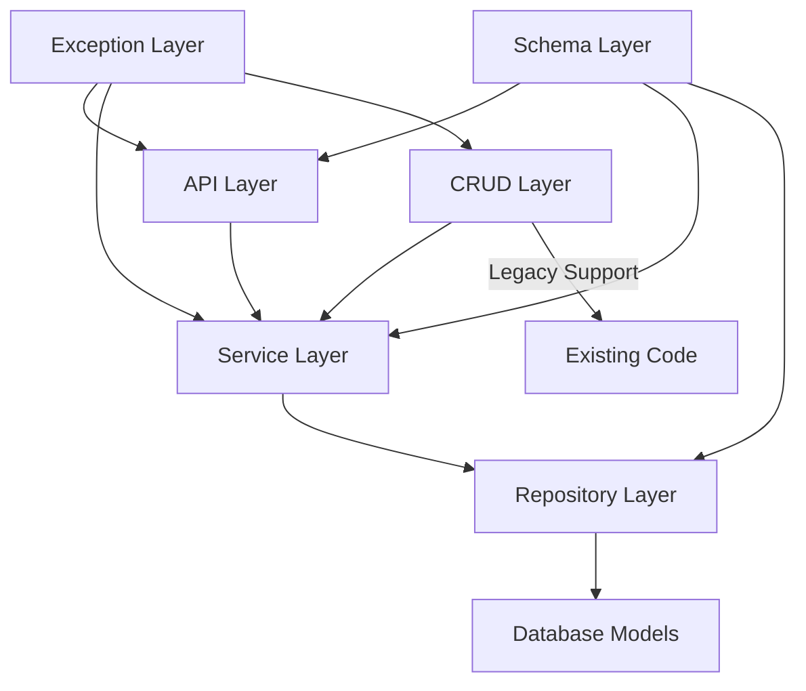

# Dataset Feature - Architecture and Developer Guide

## Overview

The dataset feature implements a robust, three-layer architecture for managing research datasets with comprehensive business logic, data validation, and backwards compatibility. This document provides a complete guide for understanding and working with the dataset codebase.

## Architecture Overview



### Layer Responsibilities

| Layer          | File            | Purpose                                    | Key Features                                      |
| -------------- | --------------- | ------------------------------------------ | ------------------------------------------------- |
| **API**        | `api.py`        | HTTP endpoints & request/response handling | FastAPI routes, validation, error handling        |
| **Service**    | `service.py`    | Business logic & transaction management    | Permission checking, business rules, transactions |
| **Repository** | `repository.py` | Data access & query optimization           | Database abstraction, query building              |
| **CRUD**       | `crud.py`       | Legacy compatibility & migration bridge    | Backwards compatibility, deprecation handling     |
| **Schemas**    | `schemas/`      | Data validation & transformation           | Request/response models, internal DTOs            |
| **Exceptions** | `exceptions.py` | Custom error handling                      | Typed exceptions, HTTP mapping                    |

## Key Design Patterns

### 1. Service Layer Pattern

**Purpose**: Encapsulate business logic and manage transactions
**Implementation**: `DatasetService` class
**Benefits**:

- Clean separation between API and data access
- Consistent business rule enforcement
- Centralized transaction management
- Easy unit testing

```python
# Example: Creating a dataset with business logic
service = DatasetService()
response = service.create_dataset(db, request)  # Handles validation, permissions, tags, etc.
```

### 2. Repository Pattern

**Purpose**: Abstract database access and enable testing
**Implementation**: `DatasetRepositoryInterface` + `DatasetRepository`
**Benefits**:

- Database technology independence
- Easy mocking for tests
- Query optimization isolation
- Consistent data access patterns

```python
# Example: Dependency injection for testing
mock_repository = MockDatasetRepository()
service = DatasetService(repository=mock_repository)
```

### 3. Custom Exception Hierarchy

**Purpose**: Typed error handling with proper HTTP mapping
**Implementation**: `DatasetError` base class with specific subclasses
**Benefits**:

- Type-safe error handling
- Automatic HTTP status code mapping
- Clear error categorization
- Better debugging information

```python
# Example: Specific exception types
try:
    service.update_dataset(db, dataset_id, request, user_id)
except DatasetPermissionError as e:
    # Automatically maps to HTTP 403
    pass
```

### 4. Schema Layering

**Purpose**: Clean data transformation between layers
**Implementation**: Separate schemas for requests, responses, and internal operations
**Benefits**:

- API versioning support
- Input validation
- Output standardization
- Internal flexibility

```python
# Example: Schema transformation
request: DatasetCreateRequest  # API input
internal: DatasetCreateInternal  # Service processing
response: DatasetResponse  # API output
```

## File Structure and Purpose

```
backend/app/features/dataset/
├── api.py                    # FastAPI endpoints and HTTP handling
├── service.py               # Business logic and transaction management
├── repository.py            # Data access and query optimization
├── crud.py                  # Legacy compatibility layer
├── exceptions.py            # Custom exception definitions
├── utils.py                 # Utility functions (tags, validation)
├── schemas/
│   ├── __init__.py         # Schema exports and backwards compatibility
│   ├── request.py          # Input validation schemas
│   ├── response.py         # Output formatting schemas
│   └── internal.py         # Inter-layer data transfer objects
└── README.md               # This documentation
```

## Working with the Dataset Feature

### For New Development (Recommended)

Use the service layer directly for new code:

```python
from backend.app.features.dataset.service import DatasetService
from backend.app.features.dataset.schemas.request import DatasetCreateRequest

# Initialize service
service = DatasetService()

# Create dataset with full business logic
request = DatasetCreateRequest(
    dataset_name="My Research Dataset",
    dataset_description="Description of the research",
    uploader_id=user_id,
    tags=["research", "2024"]
)

response = service.create_dataset(db, request)
print(f"Created dataset: {response.dataset_id}")
```

### For Legacy Code Migration

The CRUD layer provides backwards compatibility:

```python
# Legacy code (still works, but generates deprecation warnings)
from backend.app.features.dataset.crud import get_dataset_crud

dataset = get_dataset_crud(db, dataset_id)  # Warning: no user context

# Migration path
from backend.app.features.dataset.crud import get_dataset_service

service = get_dataset_service()
response = service.get_dataset(db, dataset_id)  # Modern approach
```

## Permission System

The dataset feature implements a comprehensive permission system:

### Permission Levels

1. **Dataset Creator**: Can modify/delete their datasets
2. **Dataset Owners**: Can modify datasets they own (added by creator)
3. **Admins**: Can perform any operation on any dataset
4. **Regular Users**: Can view public datasets only

### Permission Checking

All operations automatically check permissions through the service layer:

```python
# Automatic permission validation
service.update_dataset(db, dataset_id, request, current_user_id)
# ↑ Throws DatasetPermissionError if user lacks access
```

## Transaction Management

The service layer manages database transactions automatically:

### Transaction Scope

- Each service method manages its own transaction
- Success = automatic commit
- Error = automatic rollback
- Repository operations use flush() not commit()

### Example Transaction Flow

```python
def create_dataset(self, db: Session, request: DatasetCreateRequest):
    try:
        # Step 1: Validate data
        # Step 2: Create database records
        # Step 3: Handle relationships
        db.commit()  # Success: commit all changes
        return response
    except Exception as e:
        db.rollback()  # Error: rollback all changes
        raise
```

## Error Handling Strategy

### Exception Hierarchy

```
DatasetError (base)
├── DatasetNotFoundError        # HTTP 404
├── DatasetPermissionError      # HTTP 403
├── DatasetValidationError      # HTTP 400
└── DatasetOwnershipError       # HTTP 400
```

### Error Flow

1. Service layer throws typed exceptions
2. Exception handler converts to HTTP responses
3. API layer returns consistent error format

### Example Error Handling

```python
try:
    response = service.delete_dataset(db, dataset_id, user_id)
except DatasetNotFoundError:
    # Automatically becomes HTTP 404
    pass
except DatasetPermissionError:
    # Automatically becomes HTTP 403
    pass
```

## Testing Strategy

### Unit Testing Service Layer

```python
def test_create_dataset():
    # Arrange
    mock_repo = MockDatasetRepository()
    service = DatasetService(repository=mock_repo)

    # Act
    response = service.create_dataset(db, request)

    # Assert
    assert response.dataset_name == request.dataset_name
    mock_repo.create.assert_called_once()
```

### Integration Testing API Layer

```python
def test_create_dataset_endpoint():
    response = client.post("/datasets", json=dataset_data)
    assert response.status_code == 201
    assert response.json()["dataset_name"] == dataset_data["dataset_name"]
```

## Performance Considerations

### Query Optimization

- Repository layer handles query optimization
- Pagination implemented at database level
- Relationship loading optimized to avoid N+1 queries
- Search operations use database indexes

### Caching Strategy

- Service layer can be extended with caching
- Repository results are cacheable
- API responses support HTTP caching headers

## Migration Guide

### From CRUD to Service Layer

1. Replace CRUD function calls with service methods
2. Update error handling to use typed exceptions
3. Add proper user context to all operations
4. Use response schemas instead of raw models

### Deprecation Timeline

- **Phase 1**: CRUD functions wrap service calls (current)
- **Phase 2**: New code uses service directly
- **Phase 3**: Migrate existing CRUD usage
- **Phase 4**: Remove CRUD layer entirely

## Common Operations

### Creating a Dataset

```python
service = DatasetService()
request = DatasetCreateRequest(
    dataset_name="Dataset Name",
    dataset_description="Description",
    uploader_id=user_id,
    tags=["tag1", "tag2"]
)
response = service.create_dataset(db, request)
```

### Searching Datasets

```python
filters = DatasetFilterRequest(
    search_term="machine learning",
    tags=["AI", "research"],
    sort_by="downloads",
    page=1,
    limit=20
)
results = service.search_datasets(db, filters)
```

### Batch Operations

```python
request = BatchDeleteRequest(dataset_ids=[1, 2, 3])
result = service.batch_delete_datasets(db, request, user_id)
print(f"Deleted {result.deleted_count} datasets")
```

## Best Practices

### 1. Always Use Service Layer

- Prefer service methods over direct repository access
- Service layer ensures business rules and permissions
- Provides consistent transaction management

### 2. Proper Error Handling

- Catch specific exception types, not generic Exception
- Let service layer exceptions propagate to API layer
- Use typed exceptions for better debugging

### 3. Transaction Safety

- Don't call commit() in repository methods
- Let service layer manage transaction boundaries
- Always handle exceptions in service methods

### 4. Permission Context

- Always provide current_user_id to service methods
- Don't bypass permission checking
- Use admin checks only when necessary

### 5. Schema Validation

- Use appropriate schemas for each layer
- Validate input at API boundaries
- Transform data between layers cleanly

## Troubleshooting

### Common Issues

**"Dataset not found" errors**

- Check dataset ID validity
- Verify user has permission to access dataset
- Ensure dataset hasn't been deleted

**Permission denied errors**

- Verify current_user_id is provided
- Check user has appropriate relationship to dataset
- Confirm admin status if needed

**Transaction errors**

- Check for conflicting commits in repository layer
- Ensure proper exception handling in service methods
- Verify database session management

### Debugging Tips

1. **Enable debug logging**: Set logging level to DEBUG for detailed operation logs
2. **Check deprecation warnings**: Review logs for CRUD usage warnings
3. **Validate schemas**: Ensure request data matches expected schemas
4. **Test permissions**: Verify user relationships to datasets

## Future Enhancements

### Planned Improvements

- Caching layer for improved performance
- Event system for dataset lifecycle hooks
- Advanced search with Elasticsearch integration
- Dataset versioning and history tracking
- Automated data quality validation

### Extension Points

- Custom permission providers
- Alternative storage backends
- Event listeners for integrations
- Custom validation rules
- Analytics and metrics collection

---

This architecture provides a solid foundation for dataset management while maintaining backwards compatibility and enabling future enhancements. The layered approach ensures separation of concerns and makes the codebase maintainable and testable.
